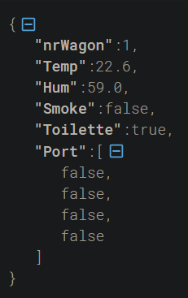
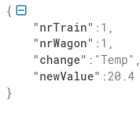
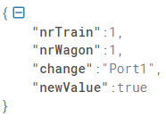

# MQTT

The protocol used is MQTT to transfer the data between [gateway](..//Gateway%20-%20RPI//gatewayDocumentation.md) (Raspberry PI) and the [database](MongoDbDocumentation.md) (Mongo DB).
We choose this protocol for its easy implementation and its scalability which is necessary to determinate the wagoon thatt is sending the data

-- --

## Broker

        The Mqtt broker used is hivemq because it's one of the best free and online broker, the pub/sub logic is written in C#

-- --

## Connection Options

        Ip: broker.hivemq.com
        Nr° Port: 1883

-- --

## Pub/Sub Topic Levels

        trainProjectWork/TrainID(numeric)/liveData
                                         /command

        |____Level1_____|____Level2______|_Level3_|

### Level 1

This first level of the Topic never change and is the name of the project

### Level 2

The second second of the Topic is the numeric ID of the train that is sending the data or the train to send the command

### Level 3

The third level of the Topic set the mode that is in use:

- **liveData** to send a message from the Gateway to the DB stored in Cloud

- **command** to send a message from the DB stored in Cloud to the Gateway

-- --

## JSON-LiveData Message Example

-- --

## JSON-Command Message Example

The first image is an example for a change of temperature

The second image is for a change of port status(close to open or vice versa)

