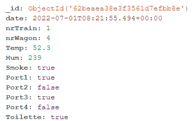

# Mongo Db

We have choose to use Mongo DB as database because it is one of the most popular database to manipulate and manage big data.

## Database name:

        trainProjectWork

## Collection Names:

        Users: Collection in which users are saved.

        Trains: Collection in which trains info are saved.

        TrainLiveData: Collection in which all the data collected through mqtt are saved.
        

## Generic Data store example:

## Users Data store example:

## Train Live Data store example:

