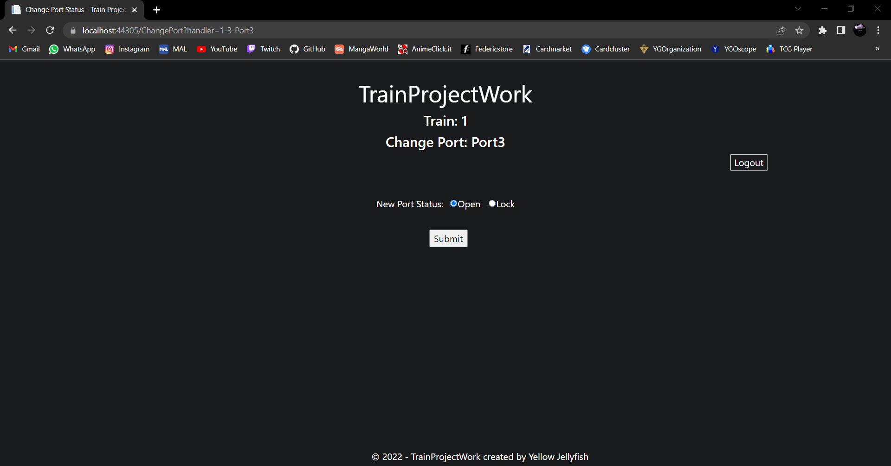

# WebApp

The Web App is an application developed with the razor pages.
It permits to control the status of the trains and to send command to control the door status and the temperature of every single wagon.

## Interfaces

### Login Interface

To use the Web App the user have to log in using his personal credential that grants to him the acces to every option he can have. The options depend on what type of role and authorization he has.

### Train Interface

This interface shows the checkable train and foreach train shows the User that is conduct the train and the number of wagon that compose the train.

If the user clicks the button of the number of a train, the train wagon specific is shown.

### Wagon Interface

This interface shows the wagon of the selected train and the data received.
The data are:
- The temperature of the wagon in Celsius degrees
- The humidity in percentage
- The status of the smoke sensor (  for none gas presence,   for dangerous gas presence)
- The status of the toilette door(  for locked door,  for unlocked door)
- The status of every external wagon door (same as toilette door)

### Change Wagon Temperature Interface

To change temperature click on the temperature's value of the corrispondent wagon, set the desired temperature and submit it.

### Change Wagon Port Status Interface

To change the doors status click on the locket of the corrispondent port of the corrispondent wagon, set the desired status and submit it.

### Logout

To logout the user click the logout button to return on the login page