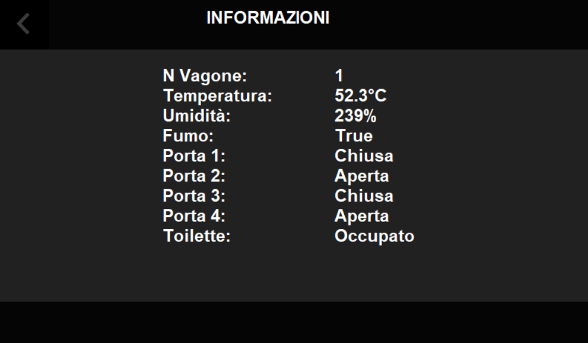

# Gateway

As gateway we have choose a Raspberry PI (RPI) wich is easy to configure and with a reduced price

## Logic

### From PIC to Cloud

When the data is sent from the microcontroller it is parsed by python function which make a json and send to the MQTT Protocol, the rest is specified on the [MQTT Protocol documentation](../Cloud%20-%20MQTT%20-%20App/MQTTDocumentation.md)

### From Cloud to PIC

- The Cloud send to the gateway by MQTT a json with the command desired;
- The Gateway receive the message by the MQTT topic;
- It extract the message content and parse it;
- In the end it send the message content by a serial port

-- --

## Redis

Redis is used to save in local the message that will be send to MQTT.
In case of assence of connection the messages will be stored in local queue to be send in a second moment, when the connection return, to the MQTT protocol 

-- --

## Graphic

The local interface of the Gateway let the user to see and monitoring the status of the train in real time by choosing the desired wagon is possible to see this interface:

